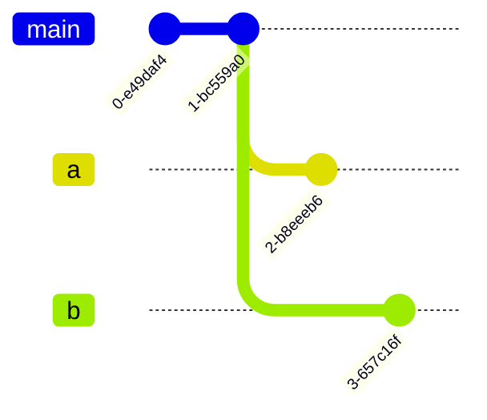
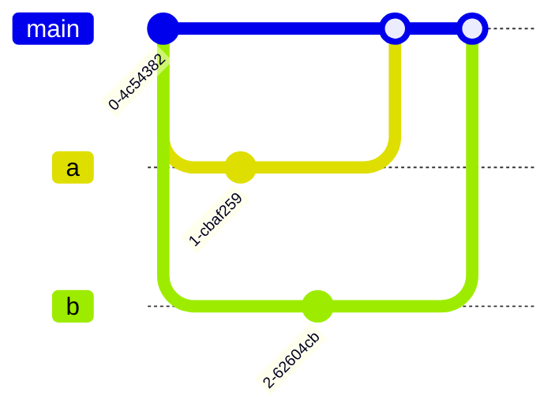
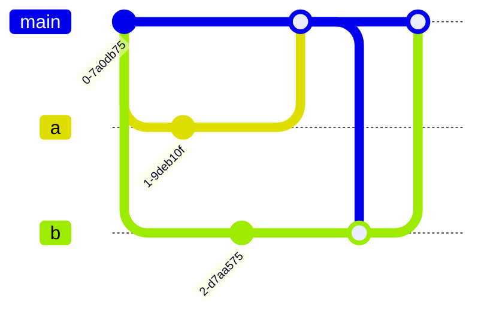

# Db Migrations with Multiverse Timetravel

Runs database migrations for apps with local / embedded databases like SQLite.
Enables you to check out feature branches during development without resetting your database.

## Table of Contents

- [What does this package do?](#what-does-this-package-do)
- [How does it do that?](#how-does-it-do-that)
- [What differentiates this package?](#what-differentiates-this-package)
- [When should I not use this package?](#when-should-i-not-use-this-package)
- [Usage](#usage)
- [Handling Branch Migrations](#handling-branch-migrations)
  - [Switching between branches](#switching-between-branches)
  - [Merging branches with diverging history](#merging-branches-with-diverging-history)

## What does this package do?

It provides an implementation of an algorithm that can be run on a database to transition it from one state/schema into another.
The database is abstracted over with an interface that a consumer of this package would have to implement.
It is therefore agnostic to which database package you're using underneath.

## How does it do that?

The developer (you) defines migrations that update the database inside of their app code.
Whenever you want a change in the db, you define a new migration.

As a rough sketch:
```dart
late final db;

void main() {
  sqlite3.open("database.db");

  Sqlite3Database(db).migrate([
    Migration(
      name: "add users table",
      definedAt: DateTime.utc(2026, 4, 12, 11, 4),
      up: "create table users",
      down: "drop table users",
    ),
  ]);

  runApp(MyApp.new);
}
```

When a user starts the app, all migrations are being run in sequence.
If the user already had an older version of the app installed, only the migrations that have been defined in the app code since that older version of the app released are being run.


## What differentiates this package?

_Db Migrations with Multiverse Timetravel_ solves a specific problem that other packages do not address:

During development, there will be multiple branches of your app code. And some branches may introduce changes to the database.
At first this is fine, the app code will automatically run the up migration when you check out a feature branch with a change to the db and you can just work.

**But what happens when you now want to go back to the main branch or check out a different feature with a different change to the database?**

The app code doesn't know the state that the database is in. And it doesn't know how to bring it back into a state in which it can work with the database again.

> [!IMPORTANT]
> _Db Migrations with Multiverse Timetravel_ addresses that problem by storing the information required to downgrade the database (like SQL code) inside of the database itself.
> 
> So it can first migrate the database back to a state that the app code knows how to work with. And then use the app code to run the remaining migrations.

## When should I not use this package?

You should **only** use _Db Migrations with Multiverse Timetravel_ when working with app/embedded/edge databases. That is databases that are only being accessed by a single instance of your app code.

You should **not** use this for live databases (perhaps running on a server[^1]) that are being accessed by multiple clients.

The strategy for migrations employed by this package lets the app code drive the database version. This cannot go well when there are two clients with different versions trying to work with the database.

[^1]: In general, when working with a central database, down migrations are probably not what you are looking for.
Imagine you made a mistake in your up migration -- what's the likelihood that your down migration is still correct?
Could it not bring your database into an undefined state?
Rollback and roll forward are more appropriate solutions here.
https://atlasgo.io/blog/2024/04/01/migrate-down, https://antman-does-software.com/why-you-will-never-write-another-down-migration

## Usage

Using [sqlite3](https://pub.dev/packages/sqlite3) and [sqlite3_migrations_with_multiverse_timetravel](sqlite3_migrations_with_multiverse_timetravel):
```dart
final migrations = [
  Migration(
    definedAt: DateTime(2025, 3, 14, 1),
    up: """
create table users (
  id integer primary key autoincrement,
  name text not null
);

insert into users (name) values ('Alice');
insert into users (name) values ('Bob');
""",
    down: """
drop table users;
""",
  ),
];

Sqlite3Database(db).migrate(migrations);
```

Else, if there is no pre-made adapter for your database package of preference:

```dart
class MyDatabase implements SyncDatabase {
  ...
}

final myDatabase = MyDatabase();
final migrator = SyncMigrator()(db: myDatabase, defined: migrations);
```

## Handling Branch Migrations

### Switching between branches

Switching between branches is always fine, because the database will first be migrated down to the point where both branches diverged and then the other branch is being taken for the up migrations.


Imagine two feature branches `a` and `b` with different changes to the database and the `main` branch with neither change.



Assuming both feature branches are being kept up-to-date with `main`, when switching from `a` branch to `b`, the database is first being migrated using the down migrations of `a` to something that `main` understands _(because both branches diverge from there, **not** because this package has any understanding of your Git repository)_ and then migrated up using the migrations defined in `b`.


### Merging branches with diverging history

Continuing from the example above, eventually branch `a` will be merged into `main`. This doesn't require any further intervention.


Now we want to merge `b` into `main`. If `b` touches different tables than `a` did you can just proceed.

<details>
<summary>Show</summary>


</details>

If there are potential conflicts, like if one migration renamed a column and the other migration added a foreign key referencing that column, you will have to deal with that conflict:

```dart
final a = Migration(
  name: "add users table",
  definedAt: DateTime.utc(2025, 3, 18, 1),
  up: "alter table users rename column 'name' to 'handle'",
  down: "alter table users rename column 'handle' to 'name'"
)

final b = Migration(
  name: "add author to posts",
  definedAt: DateTime.utc(2025, 3, 18, 1),
  up: "alter table posts add column 'author' string references users(name)",
  down: "alter table users drop column 'author'"
);
```

First merge `main` into `b`.
Then update the migrations for `b` to be compatible with `main` and update the `definedAt` field. You can now merge `b` into `main`.

<details>
<summary>Show</summary>



```dart
final b = Migration(
  name: "add author to posts",
  definedAt: DateTime.utc(2025, 3, 21, 1), // sometime later
  up: "alter table posts add column 'author' string references users(name)",
  down: "alter table users drop column 'author'"
);
```

</details>

If the database had the old migrations by `b`, but is now being driven by the code on `main`, after `a` and `b` had been merged into it, _Db Migrations with Multiverse Timetravel_ would see that the database has migrations applied that the app code doesn't know about and would then migrate these down until the database is at a migration the app code knows of. It can then run the remaining up migrations inside the app code.


